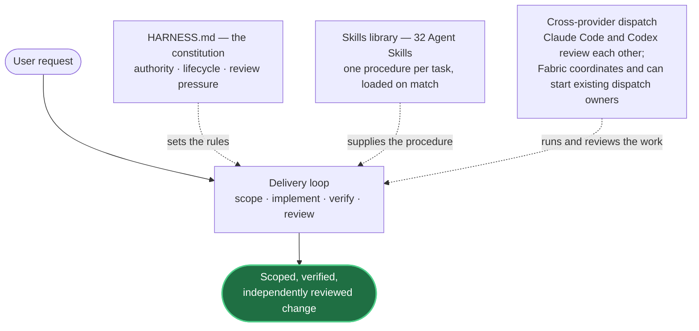
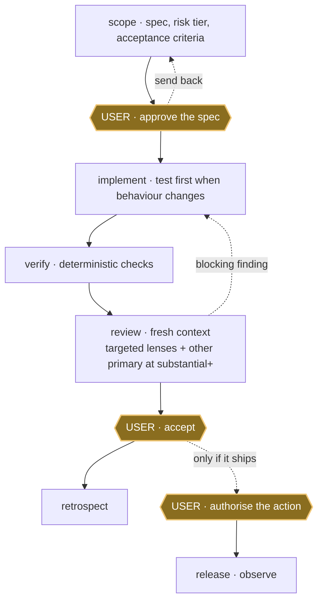

# Provenant

**A personal harness for Claude Code and Codex that turns agent work into a
scoped, verified and independently reviewed delivery workflow.**

[](https://github.com/mblauberg/provenant/actions/workflows/ci.yml)
[](LICENSE)

Provenant is a personal harness, used daily by its author. Interfaces change
without notice and support is best effort. Propose changes through
[GitHub issues](https://github.com/mblauberg/provenant/issues); report
vulnerabilities privately through [`SECURITY.md`](SECURITY.md).

## Why Provenant

A bare coding agent will write and "finish" a change in one pass, with its own
author as the only reviewer. Provenant puts structure around that:

- it **scopes** work in dialogue with the user, returning open decisions as
  questions, and requires approval before implementation starts;
- it runs **deterministic checks** before any result surfaces for review;
- it adds **review by the _other_ model family** once the work is substantial:
  Claude checks Codex, Codex checks Claude; and
- it keeps **acceptance and release as separate user decisions**.

A change therefore arrives already scoped, verified and read by a context that
did not write it, so user attention goes to judgement rather than to catching an
agent's own mistakes.

## How it fits together

Three parts act on every request at once: the constitution sets the rules, a
skill supplies the procedure, and cross-provider dispatch runs and cross-reviews
the work.
None of them is a stage the work passes through.



- **Harness:** [`HARNESS.md`](HARNESS.md) is the constitution. It sets
  authority, the delivery lifecycle, and how much review pressure each risk tier
  owes, and stays small so it can be read every session.
- **Skills:** the <!--skills-->32<!--/skills--> Agent Skills are task-specific
  procedures, one folder with a `SKILL.md` each. Only the one-line descriptions
  sit in permanent context; a full body loads only when the task matches it.
- **Fabric:** messages, shared tasks and activity between agents working on one
  project, plus two MCP tools that delegate ordinary dispatch and finite batches
  to the existing owners. One SQLite file, no daemon, nothing to provision.

## Quick start

Requirements:

- **Git** and **Python 3.11+**
- **Claude Code** or **Codex**, subscription-authenticated, per primary client
- **Node.js** `>=24.15.0 <25` and **npm** `>=11.12.1 <12` for repository
  verification (the suite shells out to `node`)
- **[uv](https://docs.astral.sh/uv/)**, or an already-built harness interpreter.
  `scripts/install-harness` and `scripts/check-harness` both select their
  interpreter through `scripts/lib/harness-python.sh`, which refuses to run
  without one, so this is a hard prerequisite rather than a convenience
- **PyYAML** and **pytest** for harness checks (`uv sync --locked --only-group
  test` installs the locked versions into `.venv/`; `scripts/check-harness`
  honours `HARNESS_PYTHON` if you would rather point at your own interpreter)

Install either platform independently, or both:

```sh
git clone https://github.com/mblauberg/provenant.git "<PRODUCT_ROOT>"
cd "<PRODUCT_ROOT>"

# build the harness interpreter; install-harness cannot run without one
uv sync --locked --only-group test

# install the pinned workspace dependencies
npm ci

scripts/install-harness --platform all

# discover commands, then verify the daemonless Fabric bus
provenant help
provenant fabric whoami

# run the repository gates when changing Provenant
provenant check   # harness policy gate
npm run check     # TypeScript gates
```

Each installer command registers the Fabric MCP server for the platform it
installs. Pass `--mcp-clients all` to either one to register all six clients
instead.

With `--platform all`, installation links skills into both primary clients and
installs the Claude subagents and workflows. A single-platform install changes
only that primary. Every install also writes a managed copy of the thin
`provenant` command in
`${PROVENANT_BIN_DIR:-$HOME/.local/bin}`; it warns when that directory is not
on `PATH`, and never edits shell startup files. During an upgrade, the installer
replaces only the legacy link that exactly names
`<instance-root>/scripts/provenant`, including a dangling link. It preserves
other files and links as user-owned. If the installer exits
non-zero, follow the message it prints: exit `3` flags a command collision,
incompatible instruction target, or managed skill-link conflict, and
instruction conflicts include the bootstrap line to add.

Exit `3` also covers a missing harness interpreter, which is what a machine
without `uv` meets first:

```text
harness-python: unusable interpreter: <PRODUCT_ROOT>/.venv/bin/python
repair: uv sync --project <PRODUCT_ROOT> --locked --only-group test
```

Run the repair line the message prints, or export `HARNESS_PYTHON` pointing at a
Python 3.11+ interpreter that already imports `yaml` and `pytest`. Every
`install-harness` and `check-harness` step is gated on this, so nothing else in
the quickstart runs until it resolves. `scripts/check-harness --doctor` reports
whether `uv` is on `PATH`.

To move the product checkout while retaining a small instance root, follow the
[split-product relocation runbook](docs/runbooks/split-product-relocation.md).

The Claude subagent links have a separate
`.agent-harness-agents-installation.json` receipt beside `~/.claude/agents/`.
Re-running the installer repairs recorded links, while unmanaged files remain
untouched.

`provenant fabric whoami` creates the project-local Fabric identity and shared
SQLite bus on first use. There is no daemon, trust record, initial provisioning or
warm/build step. `provenant check` runs the harness policy gate from the registered
checkout containing the caller, so a linked-worktree check cannot certify the
primary checkout. `npm run check` covers the Fabric typecheck and tests. It
first reports missing dependencies for that exact checkout and tells the
operator to run `npm ci`; it never installs or borrows another checkout's tree.

<details>
<summary>Filesystem layout, Codex config and uninstall</summary>

```text
<PRODUCT_ROOT>/                product checkout
  HARNESS.md                      product constitution
  runtime/  agents/  skills/  workflows/
  scripts/  config/
          |
          | scripts/install-harness
          v
~/.agents/                        thin instance
  AGENTS.md                       instance-owned instructions
  config/                         instance-owned configuration
  .agent-fabric/product-root.json machine-local product pointer

~/.claude/skills/                 managed links
~/.claude/agents/                 managed Claude subagent links
~/.codex/skills/                  managed links
~/.claude/workflows/              managed links
~/.local/bin/provenant            managed command
```

The Codex installer appends one block to `~/.codex/config.toml` disabling
Codex's bundled `skill-creator`, leaving `skill-craft` canonical; the rest of
that file is preserved.

From the product checkout,
`scripts/manage_installation.py uninstall-managed --target <skills-dir>`
reclaims the harness-owned skill links and nothing else. The bootstrap line and
the Codex block remain until removed by hand.

Fabric derives the project from the current working directory. Run
`provenant fabric whoami` from the project you mean; the first call creates its
database and registers the caller without a separate activation step. A
repository's ordinary registered linked worktrees share that Fabric project
while each caller retains its resolved working directory.

</details>

## Providers

The [Fabric MCP installer](docs/runbooks/fabric-mcp-registration.md) supports
the six host clients below. Fabric registration and direct provider execution
are separate; current dispatch activation is owned by
[adapter compatibility](config/adapter-compatibility.yaml).

| Client or provider | Fabric MCP registration | Direct provider execution |
|---|---|---|
| Claude Code | Supported | Enabled Anthropic primary |
| Codex | Supported | Enabled OpenAI primary |
| Agy | Supported | Enabled optional broker; the receipt records the runtime model family |
| Cursor | Supported | Enabled optional Composer/Grok and hosted third-party broker |
| Kiro | Supported | Disabled; see [`kiro-acp` policy](config/adapter-compatibility.yaml) |
| OpenCode | Supported | Disabled; see [`opencode-acp` policy](config/adapter-compatibility.yaml) |

Provider CLI versions and digests are diagnostic observations, not admission
locks. Direct dispatch enforces the checked-in activation decision and uses
fresh adapter capability evidence where the route requires it; a CLI update
does not by itself require a compatibility-table edit.

## Core workflows

Each task has a front-door skill; the agent loads it when a request matches.

| Need | Skill |
|---|---|
| Agree what to build | [`scope`](skills/scope/SKILL.md) |
| Deliver an approved code change | [`implement`](skills/implement/SKILL.md) |
| Deliver research, analysis or documents | [`deliver`](skills/deliver/SKILL.md) |
| Find a root cause | [`diagnose`](skills/diagnose/SKILL.md) |
| Review without changing the code | [`code-review`](skills/code-review/SKILL.md) |
| Coordinate parallel agents | [`orchestrate`](skills/orchestrate/SKILL.md) |
| Promote an accepted artifact | [`release`](skills/release/SKILL.md) |

## Lifecycle

Every change runs the delivery loop and stops at three gates reserved to the
user; receipts declare approval rather than authenticating it.



Gold hexagons are user gates; specification approval and acceptance can also
return work for revision. Scoping is usually a conversation: a decision packet
with choices and a recommendation, owner calls parked as named questions rather
than guesses, and the [`grill-me`](skills/grill-me/SKILL.md) interview, one
question per round, while material decisions stay unresolved.

The loop is [`deliver`](skills/deliver/SKILL.md), the kernel binding one run to one receipt;
[`implement`](skills/implement/SKILL.md) is its software front door, and the
full lifecycle lives in [`docs/ARCHITECTURE.md`](docs/ARCHITECTURE.md).

## What the harness guarantees

**Review pressure scales with the risk tier the work is scoped at:**

| Risk | Minimum review pressure |
|---|---|
| `routine` | chair plus objective and native checks |
| `substantial` | multiple targeted lenses plus a strong other-primary review |
| `crucial` | substantial coverage plus a distinct-family review when available |
| `terminal` | all preceding coverage with stronger targeted and adversarial pressure |

Solo `routine` work still completes, but `substantial` and above cannot reach
acceptance with the other-primary leg missing. Distinct-family review is
advisory when available; a skipped terminal distinct-family leg records its
reason. Evidence and corroboration, not model votes, make a finding blocking.
The canonical ladder lives in [`HARNESS.md`](HARNESS.md).

**Durable boundaries hold regardless of tier:**

- access and credentials never grant authority;
- creating branches and worktrees for implementation is pre-authorised;
  merge authority comes from the owning repository (this repo grants it through
  its [GitHub runbook](docs/runbooks/github-workflow.md)); deletion beyond
  post-merge pruning, force-removal and unauthorised shared-branch pushes stay
  gated;
- no two agents write one source surface at once; and
- specification approval, acceptance and release stay separate user decisions
  ([`HARNESS.md`](HARNESS.md)).

Provider workers can be dispatched through Fabric MCP or the direct command
line; both paths use the same orchestration owners and retain full output in run
files. Fabric also carries messages, shared tasks and activity between agents.
[Herdr](https://herdr.dev) is optional: it observes and sends fire-and-forget
steering; it does not provide wake, callback or completion delivery.

## Skill library

The full <!--skills-->32<!--/skills-->-skill catalogue, grouped by area:

<!-- skill-catalogue:start -->
<details>
<summary>All 32 skills</summary>

| Area | Skills |
|---|---|
| Delivery | [`session`](skills/session/SKILL.md), [`scope`](skills/scope/SKILL.md), [`grill-me`](skills/grill-me/SKILL.md), [`deliver`](skills/deliver/SKILL.md), [`implement`](skills/implement/SKILL.md), [`tdd`](skills/tdd/SKILL.md), [`refactor`](skills/refactor/SKILL.md), [`diagnose`](skills/diagnose/SKILL.md), [`code-review`](skills/code-review/SKILL.md), [`evaluate`](skills/evaluate/SKILL.md), [`release`](skills/release/SKILL.md), [`retrospect`](skills/retrospect/SKILL.md), [`work-map`](skills/work-map/SKILL.md), [`setup-repo`](skills/setup-repo/SKILL.md) |
| Orchestration | [`orchestrate`](skills/orchestrate/SKILL.md), [`autopilot`](skills/autopilot/SKILL.md) |
| Writing and documentation | [`engineering-docs`](skills/engineering-docs/SKILL.md), [`engineering-writing`](skills/engineering-writing/SKILL.md), [`academic-writing`](skills/academic-writing/SKILL.md), [`legal-writing`](skills/legal-writing/SKILL.md), [`natural-writing`](skills/natural-writing/SKILL.md) |
| Design and diagrams | [`ui-ux-design`](skills/ui-ux-design/SKILL.md), [`prototype`](skills/prototype/SKILL.md), [`d2-diagrams`](skills/d2-diagrams/SKILL.md), [`uml-diagrams`](skills/uml-diagrams/SKILL.md) |
| Web engineering | [`playwright`](skills/playwright/SKILL.md), [`react-performance`](skills/react-performance/SKILL.md), [`tanstack-query`](skills/tanstack-query/SKILL.md), [`typescript-clean-code`](skills/typescript-clean-code/SKILL.md), [`web-stack-conventions`](skills/web-stack-conventions/SKILL.md) |
| Harness development | [`skill-craft`](skills/skill-craft/SKILL.md) |
| Presentation | [`caveman`](skills/caveman/SKILL.md) |

</details>
<!-- skill-catalogue:end -->

## Documentation and help

- [`Architecture`](docs/ARCHITECTURE.md): system structure and design rationale.
- [`Specifications`](docs/specs/README.md): the component contracts.
- [`Research`](docs/research/README.md): evidence and owners.
- [`Maintenance`](MAINTAINING.md): how the repository is changed and governed.
- [`Security`](SECURITY.md): private vulnerability reporting.
- [GitHub issues](https://github.com/mblauberg/provenant/issues): normal feedback and change proposals.

Legal: [MIT licence](LICENSE) · [Notices](NOTICE) ·
[Third-party notices](THIRD_PARTY_NOTICES.md) ·
[Acknowledgements](ACKNOWLEDGEMENTS.md)
