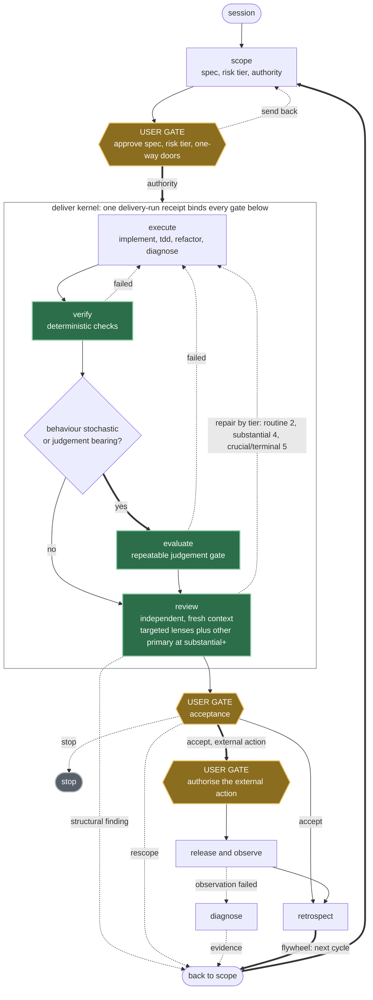
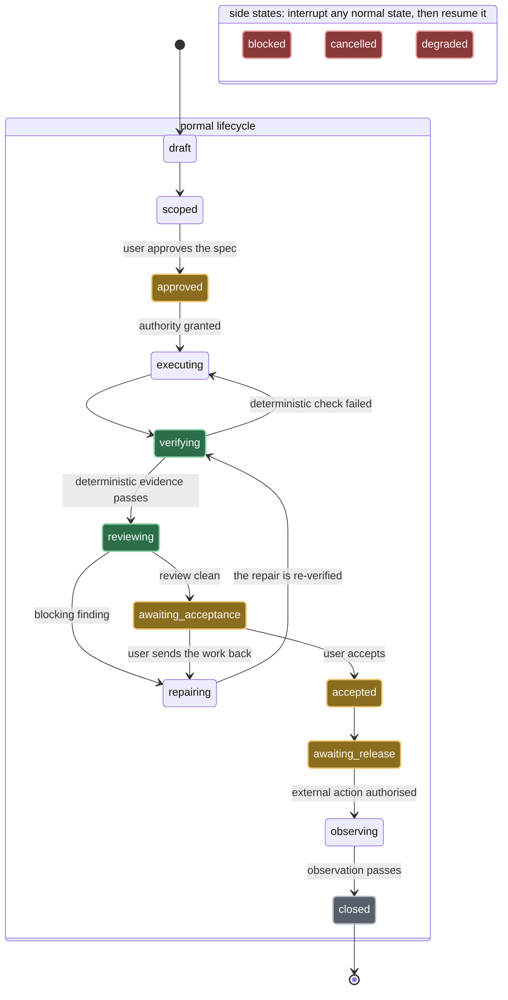
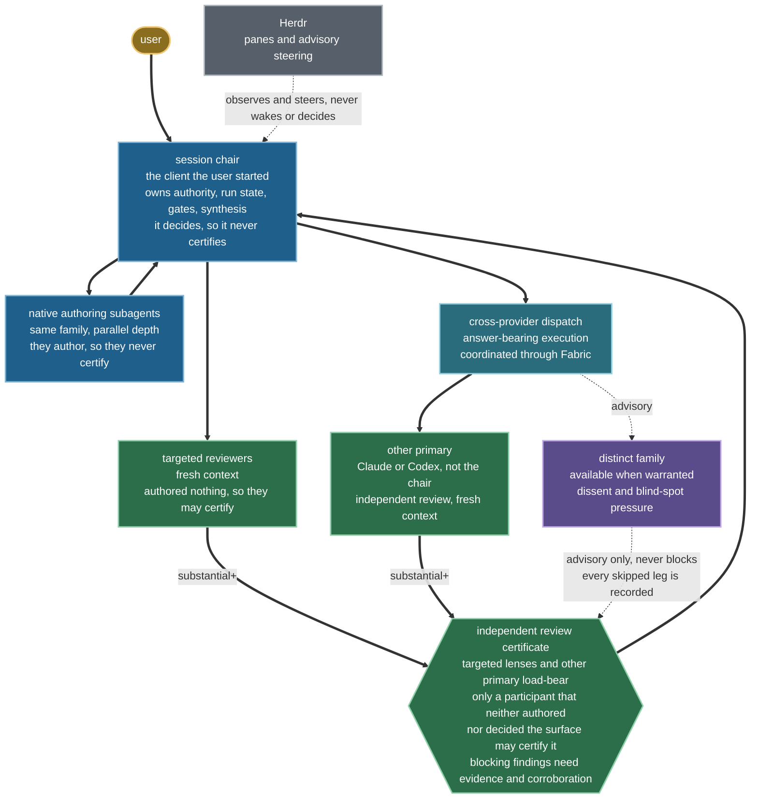

# Provenant architecture

## Purpose

Provenant is an agent harness: a gated delivery lifecycle for coding agents.
This repository is an operating system for agent work, not a prompt collection.
It implements a general agentic SDLC that can be used for software, research,
analysis, documentation and other evidence-bearing work. The objective is
quality per user attention-hour: agents create depth and verification; users
retain scarce judgement at consequential gates.

`AGENTS.md` is the tiny bootstrap every operator sees. `HARNESS.md` is the
compact runtime constitution. Skills load procedural depth only when triggered.
This document preserves the design intent so future maintainers can change the
harness without rediscovering it from individual skills.

## Lifecycle and user gates

Every run takes the same shape; what scales with risk is review pressure. At
`routine`, the chair plus objective and native checks are enough, so routine work
can complete without the other family. From `substantial` up, the review ladder
requires multiple targeted lenses and the other primary; `crucial` work adds a
distinct-family review when available, and terminal work adds stronger targeted
and adversarial pressure. `HARNESS.md` owns the ladder and
`skills/deliver/scripts/validate_delivery.py` enforces its load-bearing legs.
The three gold gates are the only places a user must decide; everything inside
the `deliver` kernel is agent work bound to one receipt.

The tier is derived rather than declared. `scope` rates every factor in
`config/risk-policy.json`, the highest tier any rating maps to is the run's
minimum tier, and a lower declared tier needs a user-approved override carrying
an approver, a reason and evidence. The table between the markers records the
current policy and is maintained with that source file.

<!-- risk-factor-table:start -->

| Factor | `routine` | `substantial` | `crucial` | `terminal` |
|---|---|---|---|---|
| blast radius | `local` | `multi-module` | `shared-system` | `production` |
| reversibility | `easy` | `moderate` | `hard` | `irreversible` |
| data sensitivity | `public` | `internal` | `confidential` | `regulated` |
| migration | `none` | `reversible` | `stateful` | `destructive` |
| oracle quality | `strong` | `mixed` | `weak` |  |
| external effects | `none` |  | `reversible` | `irreversible` |
| critical surface | `none` | `public-contract` | `auth-security`, `privacy`, `financial`, `legal`, `build-release-gate` | `life-safety` |

<!-- risk-factor-table:end -->

One palette carries the whole document. Every diagram below uses it, and no
colour means two things:

| Colour | Meaning |
|---|---|
| Gold | a user decides here |
| Green | a blocking leg: it can stop the run |
| Purple | an advisory leg: it never blocks, and a skipped leg is recorded |
| Blue | a participant that authors or decides, and so may never certify |
| Teal | transport |
| Red | an interrupt: it suspends a run, and recovery resumes the interrupted state |
| Grey | inert: stopped, closed, or observing only |

Green covers `verify`, `evaluate`, targeted review evidence and the other-primary
leg, because each can stop a run. Purple is reserved for distinct-family review,
which is advisory and recorded when unavailable or skipped.

Four paths return work to `scope`: a structural review finding, a rescope at the
acceptance gate, evidence from a failed observation, and the retrospect
flywheel. They converge on one `back to scope` collector so the picture carries
one return edge into `scope` instead of five crossing the canvas.

Two orderings in that picture are load-bearing. Deterministic verification runs
first and always. `evaluate` is a separate conditional gate that runs only when
behaviour is stochastic or judgement bearing, so deterministic checks come
before judgement and the two are never fused into one box. Review is independent:
fresh targeted reviewers and the other primary never author the surface they
certify. From `substantial` up, a receipt reaching acceptance without multiple
targeted lenses or other-primary coverage fails the machine gate.

The lifecycle loops. A failed check returns to execution; a structural review
finding may return to scope; production evidence may open a diagnosis and a new
implementation run. `retrospect` closes the quality flywheel by benchmarking
the completed trajectory, clustering root causes, proposing small
evidence-backed harness changes, adding regression gates and monitoring the
next comparable run. It promotes durable learning into canonical project docs
instead of accumulating retrospective logs. `autopilot` adds crash-safe
persistence for genuinely sprawling run-until-STOP work, but does not replace
the ordinary delivery loop.

User approval is required for:

- the specification and unresolved acceptance criteria;
- one-way-door architecture and risk-tier downgrades;
- destructive, irreversible or externally visible actions;
- external communications and production promotion;
- final acceptance.

Routine reversible implementation inside approved authority does not need a
stream of micro-approvals.

## Neutral delivery kernel

`deliver` is the cross-domain lifecycle front door and `delivery-run` schema v1 is
its portable state machine. It selects one profile from
`config/delivery-profiles.json`: software, research, analysis, document or
agent product. The high-stakes overlay adds source-authority, privacy,
qualified-review and explicit user-action controls without multiplying the
base profiles.

The state machine is enforced rather than advisory. The states, side states and
transitions are declared once in `skills/deliver/contract/lifecycle.v1.json`,
loaded through `skills/deliver/contract/lifecycle.py` and materialised by
`skills/deliver/scripts/delivery_validation_common.py`;
`skills/deliver/scripts/delivery_validation_lifecycle.py` rejects a receipt
whose recorded history jumps a gate, so the states below are the ones a run can
actually occupy. The diagram body between the markers is maintained alongside
those constants; the accessibility text, palette, class lines and edge labels
stay hand-written.

<!-- delivery-state-machine:start -->

<!-- delivery-state-machine:end -->

The three side states are drawn apart from the lifecycle on purpose. Any normal
state may be interrupted into `blocked`, `cancelled` or `degraded`, so wiring
each of them to the lifecycle would mean an edge from and to every state. Each
side state records a reason, a recovery instruction and the state it
interrupted; recovery resumes exactly that state and cannot skip a mandatory
gate. `validate_delivery.py` enforces that rule, not the picture.

Repair is the transition that people get wrong. `repairing` returns to
`verifying`, never straight to acceptance, so a repair is re-verified rather
than trusted, and `repair_cycles` must equal the number of `repairing`
transitions in the recorded history. A user at `awaiting_acceptance` can send
the work back to `repairing` as well as accept it. `closed` requires a passing
observation.

A digest-bound project policy may add a complete profile or add evidence and
measure gates to a built-in profile. Global minima load first and cannot be
removed or reclassified by the project overlay.

The kernel binds approved intent, design, authority, artifacts, deterministic
and judgement evidence, review independence, acceptance, release, observation
and retrospective linkage. Domain skills own methods; the kernel owns state
and proof. `implement` remains the software front door and uses the same
canonical receipt; there is no parallel implementation schema or adapter.
Passing deterministic evidence binds its declared, live-hash-verified artifact;
a syntactically valid digest or exit code alone is not proof.

Software execution composes bounded techniques rather than duplicating
lifecycle owners: `tdd` for new or changed observable behaviour, `refactor` for
approved behaviour-preserving structural work, and `diagnose` when root cause is
unknown. `code-review` remains source-read-only and independent. SOLID,
information hiding, cohesion, coupling, simplicity, idempotency and similar
principles are hypothesis generators; a finding still needs a concrete failure
mechanism, impact, evidence and validation route.

Frontend authority is similarly split: `ui-ux-design`'s design/make branch
supplies authorised design mutation methods inside `implement`, while its
review branch owns read-only UX, visual, accessibility and responsive
evidence. `scope` owns the
design decision and `engineering-docs` owns canonical placement. `playwright`,
`web-stack-conventions` and
`react-performance` provide tool or standards evidence without taking over the
UI finding contract. `caveman` is a presentation overlay only; it cannot narrow
evidence, authority, high-stakes clarity or an artifact's domain-writing rules.

`release` promotes one digest- or Git-revision-bound, user-accepted artifact through a separately
authorised `deploy`, `publish`, `share`, `send` or `activate` action. Targets are
typed as environments, recipients or audiences; execution may use an approved
command, connector or named user operation. Completion requires target-visible
proof and an observation/reversal contract; a successful command by itself is
not proof.

## Equal primaries, accountable ownership

Claude Code and Codex are equal primary orchestrators. Whichever harness the
user starts is the session chair and owns authority, user communication, run
state and synthesis. On substantial work it combines:

1. native same-family subagents for parallel depth, which author and so may never
   certify;
2. fresh targeted reviewers that authored none of the surface under review;
3. the other primary family for independent review;
4. an available distinct family for dissent and blind-spot discovery.

Distinct-family failure never replaces the required other-primary leg. The other
primary is required for the substantial review contract, and there is no
degradation note that buys past it: a run may execute without that leg, but
`validate_delivery.py` rejects the receipt once it reaches acceptance. The only
relief is a user-approved risk downgrade carrying an approver, a reason and
evidence. Provider-backed external workers, including the other primary and
distinct families, are dispatched as direct command-line calls and coordinated
through Fabric; dispatch procedure remains under `orchestrate`, not standalone
skills.

The picture below separates the legs that can block a run from the legs that
cannot.

Solid legs can block a run; dashed legs cannot. The targeted and other-primary
requirements are load-bearing from the substantial tier upwards:
`validate_delivery.py` rejects a receipt that reaches acceptance without multiple
targeted lenses *and* passing other-primary review, on a distinct primary family
with distinct evidence. It also requires each review row to declare
`independent_of_authorship: true`, but does not bind the certifier's agent
identity to authorship or decision custody. Validator success therefore proves
declared topology and family separation, not actor-level independence. Policy
still disqualifies the chair and authoring subagents from certifying their own
work. Blue marks exactly those participants, while independent targeted
reviewers remain eligible. Herdr sits outside the decision path entirely.
Terminal work adds stronger targeted and adversarial pressure; every skipped or
unavailable distinct-family leg is recorded.

Paired-primary mode lets Claude and Codex rotate stage ownership, coordinated
through Fabric, which carries the messages, shared tasks and activity log
between them.
It still has one chair and one active owner per stage, namespaced artifacts and
non-overlapping write scopes. Pane transcripts are transport, not durable state.
Pi is dormant by default until its provider, economics, permissions and receipt
quality are deliberately accepted.

## Routing, adapters and receipts

The router separates policy from execution:

- `config/model-routing.json` describes families, aliases and fallbacks;
- `scripts/model-route` resolves a role from runtime capabilities;
- adapter scripts execute the resolved route;
- receipts record requested and actual identity, effort and substitutions.

`flagship`, `workhorse` and `scout` are capability aliases, not permanent jobs
for a vendor. Opus is the default Claude flagship. The catalogue may configure
one bounded override occupant per risk tier. Each configured occupant is
reserved for that tier's roles, alias and effort ceiling. Runtime discovery,
not this document, determines effort support and current availability.
Lifecycle risk stays in delivery and dispatch receipts. Selecting a configured
override occupant requires the separate explicit model-override input; ordinary
risk metadata cannot change a route.

Task-class routes use the resolver's policy-owned alias and effort. Codex and
Agy produce fresh model snapshots before final resolution. Claude first
resolves that alias and effort, runs its bounded canary, then resolves with the
snapshot. The shell does not duplicate the model or task-class catalogue.

## Review as a council, not a vote

The review system borrows the useful parts of council-style workflows:
independent first passes, deliberately different lenses, anonymised challenge
where anchoring matters, and a fresh reducer that adjudicates against evidence.
It rejects majority voting and repetitive reviewers.

The review lead chooses lenses proportional to the work: correctness, security,
performance, reliability/concurrency, state and type boundaries, test coverage,
spec alignment, readability/maintainability and larger structural
simplification. Findings become blocking only when evidence and primary-family
corroboration justify it.

## Authority and concurrency

Authority is a machine-readable envelope: allowed source and artifact paths,
prohibited paths/actions, disclosure, secrets, deployment, irreversible
actions, expiry and approver. Delegation may only narrow it.

There is no overlapping concurrent source writing. Partition ownership, use
artifact-only workers, or have one serial integrator apply patches. Worktrees
are visibility and isolation aids, not permission boundaries; their shared
location and lifecycle are defined in [worktrees.md](worktrees.md).

## Context and durable memory

Project knowledge must remain visible to every family. Durable facts therefore
live in specifications, ADRs ([adr/](adr/)), runbooks and context digests.
Private harness memory is limited to cross-project user preferences. For this
repository, the `Repository process` declaration names the scope/story and
workflow-state owners: GitHub issues own the current owner, dependencies and
user gates; Project Status owns workflow state. Other repositories declare
their own owners. A project-local effort map exists only for a declared
project-docs, unavailable-tracker or cross-tracker route; it never mirrors live
work. Retention follows project and risk policy plus bounded run-artifact rules.
No canonical backlog contract, cross-store migration or god manifest is
introduced. The governing decisions are recorded in the [ADR index](adr/README.md).

Workers return compressed findings and artifact paths. Session hygiene checks
freshness, size, duplication, stale logs, scratch manifests and handoff quality.
Pruning is conservative: delete only proven run-owned ephemeral data, compact
rather than blindly append, and merge or split curated documents when their
retrieval cost signals demand it. Sibling `.worktrees` are protected and
excluded from context scans.

## Managed installation

`scripts/manage_installation.py` plans, checks, installs, reconciles and removes
only harness-owned skill links. Every normal install repairs missing or stale
managed links and retires safe managed leftovers. A versioned manifest records
current ownership, source tree digests and the bound target beside the
target skills directory. The post-install integrity check verifies catalogue
presence. Missing or noncanonical required names fail; extra symlinks resolving
outside the canonical skill tree produce warnings. Unmanaged paths are never
claimed, overwritten or automatically removed; changed managed targets fail for
user resolution. A staged temporary link is atomically replaced into place
before the manifest is written; rerunning the installer reconciles any partial
result.
The managed catalogue is the skills plus the `skills/_shared` library they
import. A per-entry layout links and receipt-tracks that library like any skill,
so an installed target root is a sufficient import root. A whole-directory
projection already exposes it and keeps no manifest at all.
Instance-owned `custom-skills/` entries join the per-entry projection without
becoming product-managed manifest entries. Their machine-local link records
contain source paths but no content digest: installation discovers names and
links directories without validating third-party content. Product resources
used by a linked skill remain addressed through `AGENTS_HOME`, which must name
the product root; helpers that resolve their own symlink may derive the same
root directly. A product and instance skill with the same name fails before
the target directory or installation receipt is mutated.
Provider bootstraps remain small and share the same precedence sentence.

`runtime/ui-evidence/` holds the deterministic detector used by
`ui-ux-design`; it is private product infrastructure, not another skill, npm
package, workspace, service, or install lifecycle. The skill keeps the stable
`scripts/detect.mjs` command and resolves the runtime from an explicit product
root or its physical source checkout. Target-project current directories,
`node_modules`, Fabric registration, seats, and state are never discovery
inputs. This one-way dependency keeps the detector independently checkable
without adding user-facing setup or a competing lifecycle owner.

`runtime/ui-live/` similarly owns the stateful live-iteration implementation,
including its browser assets, source-containment helpers, and recovery store.
The skill retains the stable `scripts/live*.mjs` commands. The runtime
uses the target project only for authorised source work and project-local live
state; it adds no package, workspace, service, registration, seat, or install
lifecycle.

Every installed file class has one owner: a product-shipped projection, an
instance-owned file, or a product template seeded once and instance-owned
thereafter ([ADR 0019](adr/0019-installed-file-class-ownership.md)).
`scripts/instance_installation.py` owns the instance side. It writes the
path-free, committable desired state at `config/installation.json`: product
name, version and install mode, `fused` when the instance root and product root
are one tree. It seeds `AGENTS.md`, `config/model-preferences.json` and
`config/model-routing.json` only when they are absent. Neither the desired state
nor a seeded file is rewritten by a later install; Git is the drift detector,
so there is no hash-drift check and no merge. The installation receipt stays the
opposite artifact: absolute target roots and digests for one machine, ignored
and never committed. The same class holds `.agent-fabric/product-root.json`, the pointer
to this machine's product checkout, rewritten on every install so that
committed instance state never carries an absolute machine path and relocating
the product is always a re-run of the installer. Split-layout startup binds the
product root for shipped runtime and compatibility owners and `${AGENTS_HOME}`;
the instance root owns its seeded routing and preference configuration.

The canonical skill catalogue is also a constrained interface. Every skill has
balanced positive, negative and boundary routes; descriptions place the trigger
and nearest exclusion early and the complete rendered catalogue stays inside
the provider discovery budget. A skill carries occasional judgement-rich
procedure, a script/hook enforces deterministic policy, an MCP/app adds an
external capability, and a plugin distributes a stable coherent bundle. Public
packs are research inputs, not wholesale imports.

## Completion evidence

Substantial runs record risk and authority, chair/stage ownership, actual model
lineage, checks and evals, reviewer independence, repair cycles, disagreements,
degradation, retained artifacts and user-gate state. Deterministic checks come
before judgement. A fluent answer without trajectory evidence is not complete.

## Design constraints for maintainers

- Keep `AGENTS.md` and `HARNESS.md` small enough to load every session.
- Put operational detail in skill references and executable checks.
- Keep model identities in routing data, not scattered prose or shell cases.
- Make optional providers additive and non-blocking.
- Prefer explicit receipts over raw transcripts or hidden memory.
- Promote only a clear reusable trigger, artifact, fixture and ownership
  boundary; keep limited evidence opt-in and provisional, and project policy
  local.
- Test failure modes that were observed in real runs, including Herdr transport,
  provider limits, context churn and partial review artifacts.
