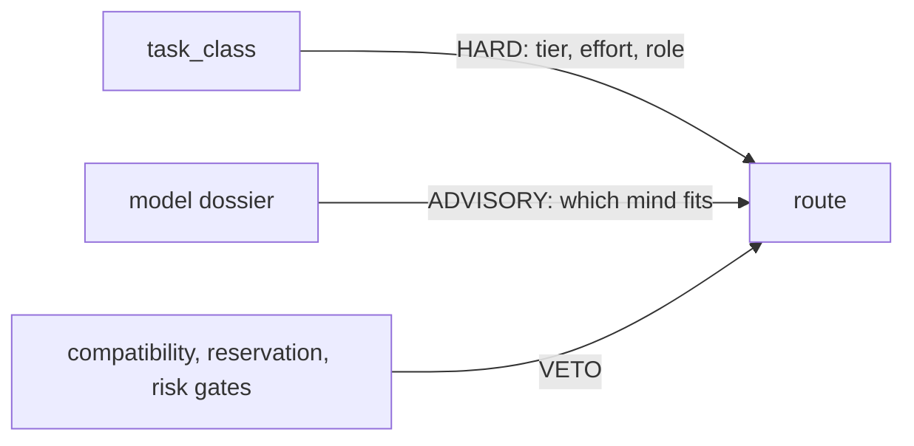

# Model dossier (advisory)

This file describes what each model is *like*, and records the standing
preferences that follow from it, so an orchestrator choosing between two
admissible routes can choose on judgement instead of looking a case up in a
table. It is the harness's opinion of the minds, not its rules about routing.

**The entries below are examples, not an enumeration.** Most real dispatch
decisions are not written here and never will be. Read the entries, form a view
of the models, then reason about the task in front of you. A task whose
character is absent is the normal case, not an error: reason from the nearest
entries and say which ones you reasoned from.

Read it before choosing a model. Prefer what it says. Depart from it when the
work calls for something else, and say why in the receipt.

## Advisory only

This file cannot change what is permitted. Nothing here is enforced by a schema
or a gate, and no script parses this file. It exists so preferences can be
written in a sentence, changed in a sentence, and read by whoever is about to
dispatch a leg.

- `task_class` decides tier, effort and role. Compatibility, reservation and
  risk gates decide admissibility. Both keep every bit of their current
  authority.
- The dossier only ranks options that are *already* admissible. It never widens
  authority, never reaches a disabled adapter, never overrides a reservation,
  tier or compatibility gate, and never blocks a dispatch.
- If a preference here disagrees with a resolved route, the resolved route wins
  and the disagreement is a signal to fix the dossier, not the router.

## What this file does not own

| Content | Owner |
|---|---|
| Task classes, tiers, roles, efforts, degradation policy | `orchestrate` skill, routing reference |
| Alias tables, family/adapter preferences, activation gates | `config/model-routing.json` |
| Resolution and receipt behaviour | `scripts/model-route` |
| Review-pressure ladder and risk tiers | `HARNESS.md` |
| Correlated-error caveat on cross-family review | `orchestrate` skill, routing reference |

Nothing above is restated here. If you want to know what a route *must* be, read
those. This file only helps you pick among what they already allow.

### The hard catalogue, and the alias order

`config/model-routing.json` is the hard catalogue and the only thing that
decides what is *admissible*. It maps a task class to an alias (`flagship`,
`workhorse`, `scout`) and each alias to the models a family can serve it with.
Those aliases are deliberately not version-pinned: that indirection is what lets
a model be swapped without touching a single call site, and it is what the
harness actually routes on.

This file sits above that. It names concrete, version-bearing models, because
that is the level real preferences live at. It never widens what the catalogue
admits, and it must never be turned into something that narrows it either. A
preference that becomes a gate has stopped being a preference.

`config/model-preferences.json` remains machine plumbing for coarse family
affinity and fair spreading. Do not put version-bearing preferences there; they
change too often and carry no room for the reason.

One mechanical detail matters when editing this file. Where an alias in the
catalogue lists several models, **the order is the resolution order**: the first
is what an automated dispatch gets, and the rest stay admissible. So a
preference written here only becomes the automatic default if the catalogue
array is ordered to match. Change both together. A preference that contradicts
the array is not a preference, it is a stale note.

## Entry format

Loose by design. An entry is a heading plus whatever labelled lines are worth
writing: `Good at`, `Watch out for`, `Cost`, `Reach`, or anything else that
turns out to matter. Nothing parses this file, so an unrecognised label, a new
model, a new category or a whole new provider is a plain text edit, with no code
change, no test to update and no schema to extend.

Where a field is blank, it is blank because nobody has recorded a view yet. Do
not read an absent `Watch out for` as an endorsement.

## Models

### Opus (Anthropic flagship)

- **Good at:** open-ended exploration; UI and UX work; open implementation and
  skeletons where the shape is not yet decided; chairing, because its human
  communication is strong.
- **Watch out for:** nothing recorded.
- **Cost:** flagship-tier; not separately characterised.
- **Reach:** `claude` and `agy` adapters, `anthropic` family.

### GPT-5.6 Sol (OpenAI flagship)

- **Good at:** correctness. Finding edge cases. Precision on a well-scoped
  slice. The owner's phrasing: *"gpt-5.6 loves to over-engineer but is very good
  at being correct."*
- **Watch out for:** over-engineers a loose brief, and chases the 0.0001% case.
  Give it a tight scope or it will invent one, and the one it invents will be
  larger than yours.
- **Cost:** flagship-tier.
- **Reach:** `codex` adapter (preferred), `cursor` as fallback; `openai` family.

### GPT-5.6 Luna (OpenAI workhorse and scout)

- **Good at:** a cheaper Sol with similar limitations. Since the roughly 80%
  price cut of July 2026 it is the family workhorse of choice at `high` or
  `xhigh` effort, and the preferred destination for high-token legwork across
  families. Still the fan-out pick where you want several Sol-shaped opinions
  and cannot pay for several Sols.
- **Watch out for:** the same over-engineering tendency as Sol, at lower
  capability. A loose brief gets the same sprawl with less of the correctness
  that redeems it; raised effort narrows that gap but a tight brief closes it.
  Effort must be raised explicitly at dispatch, because the catalogue's
  task-class efforts would hand it `medium`.
- **Cost:** cheap, and far cheaper than it was; the point of using it.
- **Reach:** `codex` adapter, `openai` family, `workhorse` and `scout` aliases.

### Sonnet 5 (Anthropic workhorse)

- **Good at:** less critical work, and exploration at low or medium effort.
- **Watch out for:** high effort is expensive for little return. If a Sonnet
  task seems to need high effort, that is usually a signal to re-route, not to
  raise the dial.
- **Cost:** workhorse-tier at low/medium; poor value at high.
- **Reach:** `claude` and `agy` adapters, `anthropic` family.

### Gemini 3.7 Flash (Google)

- **Good at:** not yet observed. Reach for it where 3.5 Flash is the recorded
  fit, that is cheap fan-out and a third cheap opinion from a different family,
  and record what you find.
- **Watch out for:** the entry above is an availability note, not experience.
  Treat a 3.7 Flash result with the scepticism due an unmeasured model until
  this line says otherwise.
- **Cost:** cheap; Flash tier, in `(High)`, `(Medium)` and `(Low)`.
- **Reach:** `agy` adapter, `google` family. Reached through `agy` only; there
  is no gemini-cli route in this harness.

### Gemini 3.8 Flash (Google)

- **Good at:** cheap fan-out, alongside Luna and Sonnet. A third cheap opinion
  from a different family. The default behind every Google alias, so an
  unqualified Gemini route lands here.
- **Watch out for:** nothing recorded.
- **Cost:** cheap.
- **Reach:** the `agy` adapter, `google` family. `cursor` does not serve Google
  models itself; its fallback map delegates them back to `agy`.

### Gemini 3.1 Pro (Google)

- **Good at:** UI and UX review. The owner's first choice for the natural,
  human voice on human-facing prose, and so the preferred final polishing
  writer. See [Human-facing final polish](#human-facing-final-polish). Recorded
  as the owner's stated preference, not a measured result.
- **Watch out for:** a polish pass is where substance quietly drifts. The chair
  keeps the last word on meaning; take the voice, re-check the facts.
- **Cost:** not recorded.
- **Reach:** the `agy` adapter, `google` family. `cursor` delegates Google
  models to `agy` rather than serving them itself.

## Categories

Notes that are about a kind of work rather than one model. Add categories the
same way you add models.

### Adversarial red-team

Alignment-tuned models tend to be weaker at *playing* an attacker. A strong
code or agent family, handed an explicit defect taxonomy, tends to be the
sharper critic. Give it the artifact plus a checklist of failure types rather
than an open invitation to criticise.

### Long-context audit

Prefer a long-context family, Gemini through Agent Fabric being the current
example, for the reading pass, then bring the distilled result back to a
flagship for the decision. The long-context model is the reader, not the
decider.

### Cheap bulk and scouting

Reach for the cheapest *diverse* family (Luna, Sonnet at low effort, Gemini
Flash, or the open models behind `kiro`) and confine it to objective fields.
Cheap minds are worth their price on extraction and classification and are a
poor bet on judgement.

### Human-facing final polish

For prose a person will actually read, such as an email, a document going out
for review, a public README or a release note, consider one last pass by a model
chosen for voice rather than for reasoning. Gemini 3.1 Pro is the current
preference. Ask it for rewrite advice or a full suggested rewrite.

This is a suggestion, never a required leg. Three bounds keep it safe:

- **The chair owns substance.** Treat the return as a proposal. Adopt the
  phrasing, then diff it against the source for changed facts, numbers, names,
  citations, hedging and scope. A polish pass that alters meaning is rejected,
  not negotiated.
- **Human-facing work only.** Skip it for skills, specs, receipts, commit
  messages and other agent-facing files. Their readers are machines and the
  overhead buys nothing.
- **Last, not instead.** It follows the owning writing skill rather than
  replacing it; `natural-writing` and its specialists still own the doctrine.

This is an ordinary cross-family dispatch and carries no special disclosure
rule. It goes out under the same authority preflight as every other external
route, and material too sensitive to leave the workspace should not be in the
workspace an agent is working in.

### Effort as a substitute for tier

An effort-controllable flagship can stand in for a mid model when the CLI
exposes effort control and the cost and latency are acceptable. Treat this as a
dated local heuristic rather than doctrine, and smoke-test the route against the
actual task before relying on it.

## Current preferences

**Token-heavy legwork goes to OpenAI, and the workhorse there is
`gpt-5.6-luna` at raised effort.** Reading a lot to produce a report, exhaustive
inventories, mechanical sweeps: these are cheaper there and Claude's budget is
better spent on judgement. Luna's price was cut by roughly 80% in July 2026,
which makes Luna at `high` or `xhigh` the best value in the family for
high-token work; go to `max` when a leg genuinely deserves it. `gpt-5.6-terra`
stays admissible but is no longer the preferred default.

That is the old standing wish made real by the price cut. The mechanical caveat
that used to block it was that effort is fixed per task class, so ordering Luna
first in the catalogue array on its own would have bought Luna at *medium*, a
downgrade rather than the trade intended, and the array was left alone for that
reason. Both halves now move together: `openai.aliases.workhorse` lists Luna
first, and `openai.role_effort_defaults.worker.workhorse` raises the effort to
`high`, which outranks the `legwork` task class default of `medium`. The raise
is scoped to the OpenAI family on purpose, so Anthropic and Google workhorse
routes stay at `medium` rather than inheriting a cost rise nobody asked for.
Reach for `xhigh` or `max` explicitly when a leg deserves it, and record the
model and effort pair in the receipt. A cheap model with the effort dial up
beats a dearer model at medium.

**`gpt-5.6-sol` stays the OpenAI flagship, reserved for critical and
high-stakes slices.** Give it the work that is genuinely hard or where a miss
is expensive; everything below that now belongs to Luna at raised effort.
Getting this backwards wastes both.

**Anthropic minds are for judgement, not volume.** Keep Opus and Fable for
chairing, adjudication, synthesis and critical review, and reach for them less
often on lower-stakes tasks: Haiku and Sonnet are not priced well enough to be
the cheap alternative, so menial and high-token slices route to Luna instead.
Where workhorse work must stay Anthropic, prefer Opus at low or medium effort
over Sonnet at a higher one. The catalogue lists Opus under
`anthropic.aliases.workhorse` so this is a real option rather than a
flagship-only escape hatch.

**Orchestration stays with Anthropic**, at flagship and high effort. Decomposition,
synthesis and final calls are the chair's job.

**Gemini for writing style, naturalisation and polish passes, not for core
changes.** It is chosen for voice, not for reasoning. Use it to make prose read
naturally; do not hand it the logic. `gemini-3.8-flash` is the default across
every Gemini alias: it is cheap, genuinely a different family for cross-family
review legs, and reachable at `-high`, `-medium` and `-low`. Reserve
`gemini-3.1-pro-high` for registers carrying legal or regulatory risk.

**Critical review has no fixed family.** The cross-family obligation is relative
to whoever chairs the run, so the right second family depends on the first. Do
not write a standing preference here; pick the family that is *not* the author's
and record it.

## Reaching Gemini

Invoke it as `agy --add-dir DIR --model gemini-3.8-flash-high -p PROMPT`.
The model flag is `--model`, not `-m`, and the value is the identifier shown
by `agy models`. Never pass `--dangerously-skip-permissions`; `agy` prints that
suggestion on every denial, and following it hands Gemini every tool at once.

Headless mode cannot prompt, so it auto-denies anything not already allowed.
The three tool families behave differently, and the differences were measured,
not inferred:

- **Reads work only through `--add-dir`.** A `read_file(...)` allow-rule with a
  glob does not match; a read outside the added directories is denied even when
  a `read_file(/some/prefix/**)` rule appears to cover it. Add the directory and
  reads inside it just work. This is the mechanism to rely on.
- **`write_file` matches exact literal paths only.** Globs never match, in
  either the `/tmp` or the `/private/tmp` spelling. Allowing a write means
  writing that one full path into `permissions.allow` before the run.
- **`command(NAME)` matches the binary and admits any arguments.** `command(rg)`
  permits `rg` with arbitrary flags. Rules of this shape are far broader than
  they look: `command(sed)` includes `sed -i`, which writes files.

The practical consequence: do not ask Gemini to write its own output file.
Generate any diff yourself, pass the directory with `--add-dir`, and redirect
the CLI's stdout to capture the review. That path needs no allow-rules at all.

## Entries awaiting owner assessment

The models below are named by `config/model-routing.json` but the owner has not
characterised them. **The lines here are configuration facts, not the owner's
opinion, and should not be read as one.** Anyone may replace a line with a real
assessment; until then, route these on the hard axis alone.

| Model | Configured position | Status |
|---|---|---|
| Haiku | `anthropic` scout alias | needs owner review |
| GPT-5.6 Terra | `openai` workhorse alias | needs owner review |
| Fable | `anthropic` crucial and terminal override for synthesis and adjudication, effort capped at medium | needs owner review |
| Grok | reachable through the `cursor` adapter, `xai` family | needs owner review |
| Cursor Composer | reachable through the `cursor` adapter | needs owner review |
| DeepSeek | `deepseek` endpoint, reached through the `claude` adapter | needs owner review |
| Moonshot Kimi | `moonshot-kimi` endpoint, reached through the `claude` adapter | needs owner review |
| Zhipu GLM | `zai-glm` endpoint, reached through the `claude` adapter | needs owner review |

## Recording the preference

Cite the entry heading when one of these entries actually decided a route. The
`orchestrate` skill's routing reference owns that convention and where the
citation goes; it is not repeated here.

## Maintenance

Edit this file directly. It needs no migration, no baseline and no regenerated
fixture, which is the entire point. If a preference here starts being treated as
binding, that is a bug in the caller, not a reason to formalise the file.

These notes are version-specific and they decay. That is expected and is the
reason the file is prose rather than a schema: a claim like "loves to
over-engineer but is very good at being correct" is worth writing down precisely
because it will stop being true, and rewriting one paragraph must cost nothing.

- A new model release is one new entry, not an audit of every use case.
- Delete a claim the moment it stops matching what you observe. A stale entry is
  worse than an absent one.
- Keep entries in the owner's own terms. Do not balance or soften an assessment,
  and do not invent one for a model nobody has used.
