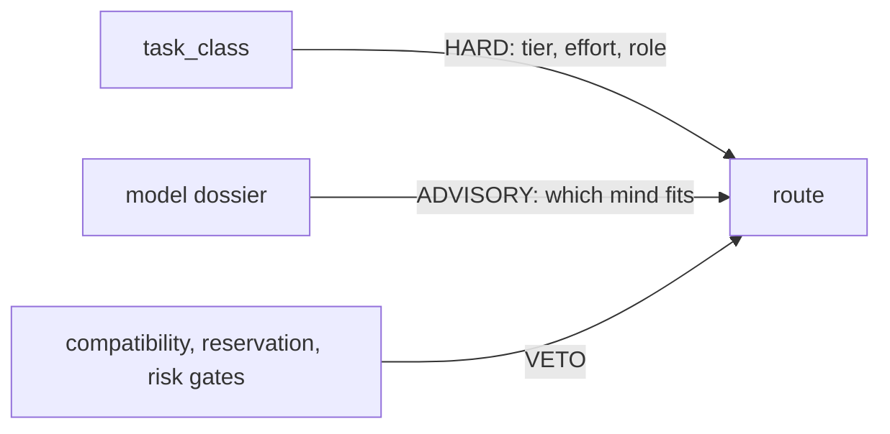

# Model dossier (advisory)

This file describes what each model is *like*, so an orchestrator choosing
between two admissible routes can choose on judgement instead of looking a case
up in a table. It is the harness's opinion of the minds, not its rules about
routing.

**The entries below are examples, not an enumeration.** Most real dispatch
decisions are not written here and never will be. Read the entries, form a view
of the models, then reason about the task in front of you. A task whose
character is absent is the normal case, not an error: reason from the nearest
entries and say which ones you reasoned from.

## Advisory only

This file cannot change what is permitted.

- `task_class` decides tier, effort and role. Compatibility, reservation and
  risk gates decide admissibility. Both keep every bit of their current
  authority.
- The dossier only ranks options that are *already* admissible. It never widens
  authority, never reaches a disabled adapter, never overrides a reservation,
  tier or compatibility gate, and never blocks a dispatch.
- If a preference here disagrees with a resolved route, the resolved route wins
  and the disagreement is a signal to fix the dossier, not the router.

## What this file does not own

| Content | Owner |
|---|---|
| Task classes, tiers, roles, efforts, degradation policy | `orchestrate` skill, routing reference |
| Alias tables, family/adapter preferences, activation pins | `config/model-routing.json` |
| Resolution and receipt behaviour | `scripts/model-route` |
| Review-pressure ladder and risk tiers | `HARNESS.md` |
| Correlated-error caveat on cross-family review | `orchestrate` skill, routing reference |

Nothing above is restated here. If you want to know what a route *must* be, read
those. This file only helps you pick among what they already allow.

## Entry format

Loose by design. An entry is a heading plus whatever labelled lines are worth
writing: `Good at`, `Watch out for`, `Cost`, `Reach`, or anything else that
turns out to matter. Nothing parses this file, so an unrecognised label, a new
model, a new category or a whole new provider is a plain text edit — no code
change, no test to update, no schema to extend.

Where a field is blank, it is blank because nobody has recorded a view yet. Do
not read an absent `Watch out for` as an endorsement.

## Models

### Opus (Anthropic flagship)

- **Good at:** open-ended exploration; UI and UX work; open implementation and
  skeletons where the shape is not yet decided; chairing, because its human
  communication is strong.
- **Watch out for:** nothing recorded.
- **Cost:** flagship-tier; not separately characterised.
- **Reach:** `claude` and `agy` adapters, `anthropic` family.

### GPT-5.6 Sol (OpenAI flagship)

- **Good at:** correctness. Finding edge cases. Precision on a well-scoped
  slice. The owner's phrasing: *"gpt-5.6 loves to over-engineer but is very good
  at being correct."*
- **Watch out for:** over-engineers a loose brief, and chases the 0.0001% case.
  Give it a tight scope or it will invent one, and the one it invents will be
  larger than yours.
- **Cost:** flagship-tier.
- **Reach:** `codex` adapter (preferred), `cursor` as fallback; `openai` family.

### GPT-5.6 Luna (OpenAI scout)

- **Good at:** a cheaper Sol with similar limitations. Good for parallel
  fan-out where you want several Sol-shaped opinions and cannot pay for several
  Sols. Suits trivial and well-bounded slices.
- **Watch out for:** the same over-engineering tendency as Sol, at lower
  capability. A loose brief gets the same sprawl with less of the correctness
  that redeems it.
- **Cost:** cheap; the point of using it.
- **Reach:** `codex` adapter, `openai` family, `scout` alias.

### Sonnet 5 (Anthropic workhorse)

- **Good at:** less critical work, and exploration at low or medium effort.
- **Watch out for:** high effort is expensive for little return. If a Sonnet
  task seems to need high effort, that is usually a signal to re-route, not to
  raise the dial.
- **Cost:** workhorse-tier at low/medium; poor value at high.
- **Reach:** `claude` and `agy` adapters, `anthropic` family.

### Gemini 3.6 Flash (Google)

- **Good at:** not yet observed. Reach for it where 3.5 Flash is the recorded
  fit — cheap fan-out and a third cheap opinion from a different family — and
  record what you find.
- **Watch out for:** the entry above is an availability note, not experience.
  Treat a 3.6 Flash result with the scepticism due an unmeasured model until
  this line says otherwise.
- **Cost:** cheap; Flash tier, in `(High)`, `(Medium)` and `(Low)`.
- **Reach:** `agy` adapter, `google` family. Reached through `agy` only —
  there is no gemini-cli route in this harness.

### Gemini 3.5 Flash (Google)

- **Good at:** cheap fan-out, alongside Luna and Sonnet. A third cheap opinion
  from a different family.
- **Watch out for:** nothing recorded.
- **Cost:** cheap.
- **Reach:** `agy` adapter (preferred), `cursor` as fallback; `google` family.

### Gemini 3.1 Pro (Google)

- **Good at:** UI and UX review. The owner's first choice for the natural,
  human voice on human-facing prose, and so the preferred final polishing
  writer — see [Human-facing final polish](#human-facing-final-polish). Recorded
  as the owner's stated preference, not a measured result.
- **Watch out for:** a polish pass is where substance quietly drifts. The chair
  keeps the last word on meaning; take the voice, re-check the facts.
- **Cost:** not recorded.
- **Reach:** `agy` adapter (preferred), `cursor` as fallback; `google` family.

## Categories

Notes that are about a kind of work rather than one model. Add categories the
same way you add models.

### Adversarial red-team

Alignment-tuned models tend to be weaker at *playing* an attacker. A strong
code or agent family, handed an explicit defect taxonomy, tends to be the
sharper critic. Give it the artifact plus a checklist of failure types rather
than an open invitation to criticise.

### Long-context audit

Prefer a long-context family — Gemini through Agent Fabric is the current
example — for the reading pass, then bring the distilled result back to a
flagship for the decision. The long-context model is the reader, not the
decider.

### Cheap bulk and scouting

Reach for the cheapest *diverse* family — Luna, Sonnet at low effort, Gemini
Flash, or the open models behind `kiro` — and confine it to objective fields.
Cheap minds are worth their price on extraction and classification and are a
poor bet on judgement.

### Human-facing final polish

For prose a person will actually read — an email, a document going out for
review, a public README, a release note — consider one last pass by a model
chosen for voice rather than for reasoning. Gemini 3.1 Pro is the current
preference. Ask it for rewrite advice or a full suggested rewrite.

This is a suggestion, never a required leg. Three bounds keep it safe:

- **The chair owns substance.** Treat the return as a proposal. Adopt the
  phrasing, then diff it against the source for changed facts, numbers, names,
  citations, hedging and scope. A polish pass that alters meaning is rejected,
  not negotiated.
- **Human-facing work only.** Skip it for skills, specs, receipts, commit
  messages and other agent-facing files. Their readers are machines and the
  overhead buys nothing.
- **Last, not instead.** It follows the owning writing skill rather than
  replacing it; `natural-writing` and its specialists still own the doctrine.

### Effort as a substitute for tier

An effort-controllable flagship can stand in for a mid model when the CLI
exposes effort control and the cost and latency are acceptable. Treat this as a
dated local heuristic rather than doctrine, and smoke-test the route against the
actual task before relying on it.

## Entries awaiting owner assessment

The models below are named by `config/model-routing.json` but the owner has not
characterised them. **The lines here are configuration facts, not the owner's
opinion, and should not be read as one.** Anyone may replace a line with a real
assessment; until then, route these on the hard axis alone.

| Model | Configured position | Status |
|---|---|---|
| Haiku | `anthropic` scout alias | needs owner review |
| GPT-5.6 Terra | `openai` workhorse alias | needs owner review |
| Fable | `anthropic` crucial and terminal override for synthesis and adjudication, effort capped at medium | needs owner review |
| Grok | reachable through the `cursor` adapter, `xai` family | needs owner review |
| Cursor Composer | reachable through the `cursor` adapter | needs owner review |

## Recording the preference

Cite the entry heading when one of these entries actually decided a route. The
`orchestrate` skill's routing reference owns that convention and where the
citation goes; it is not repeated here.

## Maintenance

These notes are version-specific and they decay. That is expected and is the
reason the file is prose rather than a schema: a claim like "loves to
over-engineer but is very good at being correct" is worth writing down precisely
because it will stop being true, and rewriting one paragraph must cost nothing.

- A new model release is one new entry, not an audit of every use case.
- Delete a claim the moment it stops matching what you observe. A stale entry is
  worse than an absent one.
- Keep entries in the owner's own terms. Do not balance or soften an assessment,
  and do not invent one for a model nobody has used.
