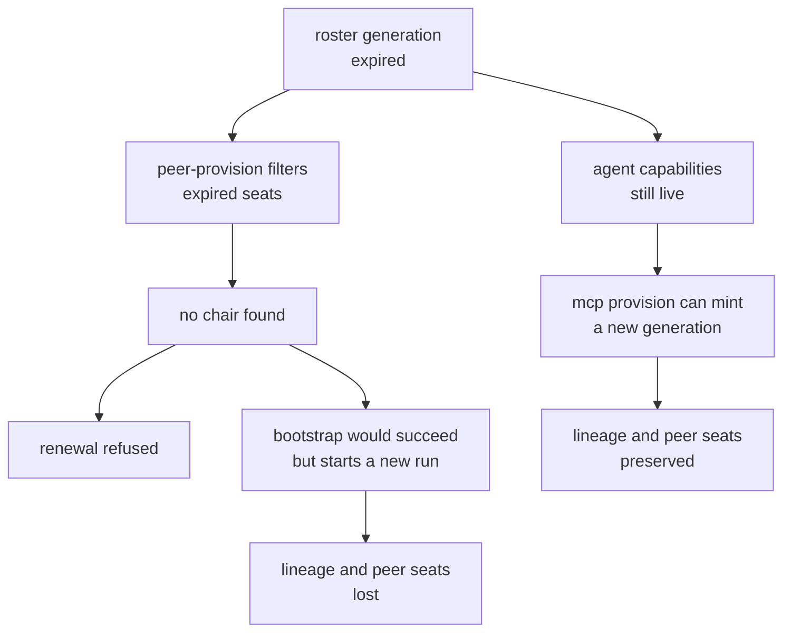

# Runbook: expired MCP seat roster

Applies when every MCP seat for a project has passed its expiry, and
`mcp peer-provision` refuses with:

```text
MCP peer provisioning requires an active chair seat for <project>;
run agent-fabric bootstrap --seat claude or agent-fabric bootstrap --seat codex from that project
```

Do not reach for `bootstrap` first. It works, but it starts a new session and run,
which abandons the existing lineage and drops any peer seats the roster had. Use
this runbook when you want the roster preserved.

## What has actually gone wrong

Renewal is only available while at least one seat is still valid.
`installedRoster` filters expired seats before it looks for the chair:

```ts
// runtime/agent-fabric/src/cli/mcp-peer-provision.ts
if (!(Date.parse(metadata.expiresAt) > Date.now())) continue;
```

With every seat expired the roster reads as empty, no chair is found, and the
renewal path cannot run at all. Nothing is corrupt. The generation is simply past
its expiry, and the verb that would extend it declines to look at it.

The recoverable part is that the underlying agent capabilities normally outlive the
roster by a wide margin. Only the seat generation has lapsed, so a new generation
can be minted over the same identities.



## Recovery

None of these steps is destructive. Seat generation directories are additive and
the database forbids `UPDATE` and `DELETE` on `mcp_seat_generations`, so recovery
adds a generation rather than altering one.

Set the state directory once:

```sh
FABRIC_STATE="$HOME/.local/state/agent-harness/fabric"
DB="$FABRIC_STATE/fabric-v1.sqlite3"
```

### 1. Confirm the roster has expired rather than gone stranded

```sh
sqlite3 -header -column "$DB" "
SELECT p.canonical_root AS root,
       substr(a.generation,1,8) AS gen,
       datetime(g.expires_at/1000,'unixepoch') AS expires_utc,
       CAST((g.expires_at/1000 - CAST(strftime('%s','now') AS INTEGER))/3600 AS INTEGER) AS hours_left
  FROM mcp_active_seat_generations a
  JOIN mcp_seat_generations g ON g.generation=a.generation
  JOIN projects p ON p.project_id=g.project_id
 ORDER BY g.expires_at;"
```

Cast the current time explicitly. `g.expires_at/1000 < strftime('%s','now')`
compares an integer against text, which is always true in SQLite, so an uncast
comparison reports every roster as expired.

If the database generation and the filesystem pointer at
`seats/<project-key>/current.json` disagree, this is a *stranded* generation
instead. Use `fabric-stranded-bootstrap-generation.md`.

### 2. Confirm the seats are `provisioned` rather than `bootstrap`

```sh
python3 -c "
import json,glob,os
for f in glob.glob(os.path.expanduser('~/.local/state/agent-harness/fabric/seats/*/generations/*/*.json')):
    d=json.load(open(f))
    if d.get('projectPath')=='<project>':
        print(d['seat'], d.get('originKind'), d['expiresAt'])"
```

A `bootstrap` roster renews itself through interception on next use from the seat
project, so prefer that over a manual rebind. Continue here only for a
`provisioned` roster, which has no automatic renewal.

### 3. Confirm the agent capabilities are still live

```sh
sqlite3 -header -column "$DB" "
SELECT agent_id, principal_generation,
       datetime(expires_at/1000,'unixepoch') AS cap_expires,
       CASE WHEN revoked_at IS NULL THEN 'live' ELSE 'revoked' END AS state
  FROM capabilities WHERE run_id='<run-id>' ORDER BY agent_id;"
```

Every seat needs one live, unrevoked capability with an expiry in the future. If
they are all revoked or expired there is nothing to rebuild over, and `bootstrap`
is the only remaining path.

### 4. Read the live binding identity, not the stored metadata

This is the step that catches people out. The compare-and-swap in
`runtime/agent-fabric/src/core/fabric.ts` validates against the **live** session
revision, while `<seat>.json` records the revision as it stood when that generation
was minted. If the session has advanced since, passing the stored value fails with
`MCP binding identity is stale or crossed`.

Take these values from the database:

```sh
sqlite3 -header -line "$DB" "
SELECT session.revision AS session_revision, session.generation AS session_generation,
       session.state AS session_state,
       run.revision AS run_revision, run.lifecycle_state AS run_state,
       run.chair_agent_id, run.chair_generation, run.chair_lease_id,
       lease.holder_agent_id, lease.generation AS lease_generation, lease.status AS lease_status
  FROM project_sessions session
  JOIN runs run ON run.project_session_id=session.project_session_id
  JOIN run_chair_leases lease
    ON lease.project_session_id=run.project_session_id
   AND lease.run_id=run.run_id AND lease.lease_id=run.chair_lease_id
 WHERE session.project_session_id='<session-id>' AND run.run_id='<run-id>';"
```

The rebind requires `session_state` and `run_state` to be `active` or
`visibility_degraded`, and `lease_status` to be `active`. If they are not, this is
a lifecycle problem and not an expiry problem.

Take the remaining fields from the current seat metadata: `projectSessionId`,
`runId`, `chairLeaseId`, and each seat's `agentId` and `principalGeneration`.

### 5. Mint the replacement generation

```sh
provenant fabric mcp provision \
  --project '<project>' \
  --project-session-id '<session-id>' \
  --session-revision <live session_revision> \
  --session-generation <live session_generation> \
  --run-id '<run-id>' --run-revision <live run_revision> \
  --chair-seat <chair seat> --chair-agent-id '<chair agent id>' \
  --chair-generation <live chair_generation> \
  --chair-lease-id '<chair lease id>' \
  --seat-bindings '<seat>=<agent-id>@<principal-generation>,...' \
  --expires-at <ISO timestamp>
```

List **every** seat in `--seat-bindings`, including the chair. A seat omitted here
is absent from the new generation. Keep the requested expiry inside the 31 day
maximum seat lifetime.

### 6. Verify

Four checks, all of which should agree:

```sh
# database active generation and expiry
sqlite3 -header -column "$DB" "
SELECT substr(a.generation,1,8) AS gen, datetime(g.expires_at/1000,'unixepoch') AS expires_utc
  FROM mcp_active_seat_generations a
  JOIN mcp_seat_generations g ON g.generation=a.generation
  JOIN projects p ON p.project_id=g.project_id
 WHERE p.canonical_root='<project>';"

# filesystem pointer, and that it chains to the expired generation
python3 -m json.tool "$FABRIC_STATE/seats/<project-key>/current.json"

# each seat resolves
for seat in codex claude agy; do
  provenant fabric mcp seat-path --project '<project>' --seat "$seat"
done
```

Expect the database generation and the filesystem `generation` to be identical, the
filesystem `previousGeneration` to name the generation that expired, the new expiry
to be in the future, and every seat to resolve to a credential file that exists.

## Prevention

Renew before expiry, not after. Inside the warning window
`mcp peer-provision --project <path> --seat <peer seat> --expires-at <ISO>` extends
the roster in one command and needs none of the above.

Note that a roster created by `bootstrap` starts with a 24 hour expiry while the
warning threshold is 7 days, so the warning is true from the moment the roster is
created and does not indicate urgency on its own. Check the actual expiry rather
than trusting the presence or absence of a warning. See issue #526.
