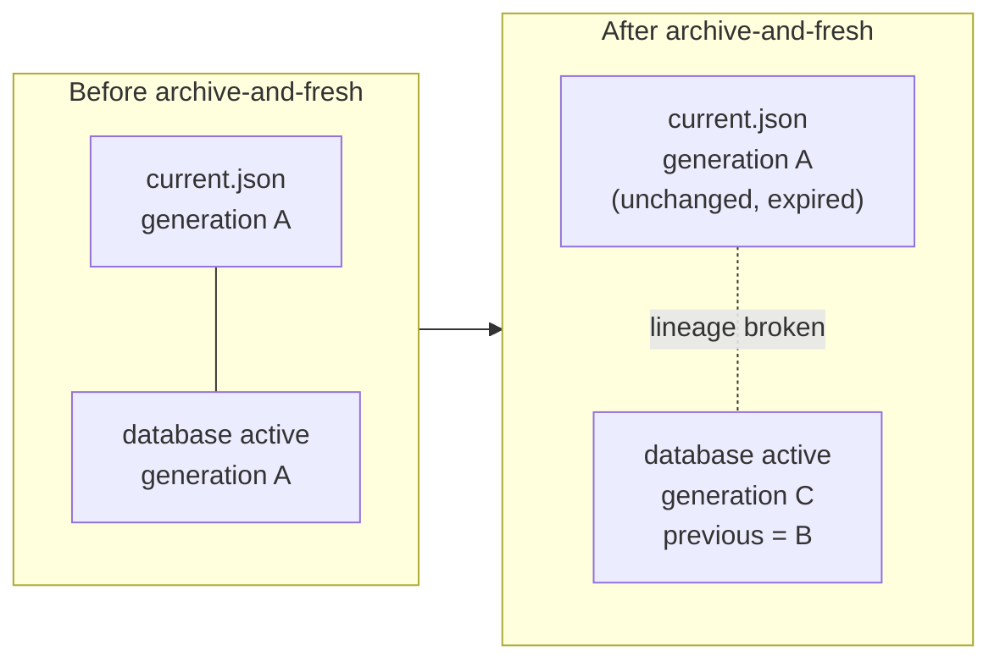

# Runbook: stranded bootstrap seat generation

Applies when `provenant fabric bootstrap --seat <seat>` fails with
`BOOTSTRAP_GENERATION_CHANGED` and the message
`Fabric bootstrap seat generation changed during local cutover`, and keeps
failing on every retry rather than succeeding once the contention clears.

## What has actually gone wrong

A genuine concurrent bootstrap produces this error transiently, and retrying
clears it. A *stranded* generation does not clear, because there is no
contention to wait out.

An `archive-and-fresh` operation on the daemon database starts a new credential
lineage. The filesystem seat pointer at `seats/<project-key>/current.json` is
not part of that operation, so it stays on the generation the archived database
recorded as active. Bootstrap then compares the pointer it can see against the
predecessor the daemon expects, the two no longer share a lineage, and the
compare-and-swap fails permanently.

The distinguishing signal is that the filesystem generation and the database
generation disagree, and the archived database names the filesystem's generation
as its own former active generation.



## Recovery

None of these steps is destructive. Do **not** run another `archive-and-fresh`,
delete generation directories, or hand-edit `current.json`. Generation
directories are immutable and are what makes the recovery auditable afterwards.

### 1. Confirm no bootstrap is running

```sh
ps -ax -o pid=,command= | rg 'provenant fabric bootstrap|agent-fabric.*bootstrap'
```

Changes nothing. If a real bootstrap process appears, this may be ordinary
contention after all: wait for it to finish, retry, and stop here if that
succeeds.

### 2. Record the current values before changing anything

Substitute the project key for the affected project.

```sh
seat_state_root=/Users/user/.local/state/agent-harness/fabric
seat_project_key=<PROJECT-KEY>
seat_pointer="$seat_state_root/seats/$seat_project_key/current.json"

jq . "$seat_pointer"
sqlite3 -readonly "$seat_state_root/fabric-v1.sqlite3" \
  "select a.generation, g.previous_generation
     from mcp_active_seat_generations a
     join mcp_seat_generations g on g.generation=a.generation
     join projects p on p.project_id=a.project_id
    where p.canonical_root='<CANONICAL-ROOT>';"
```

Changes nothing. Keep the output. Expect the filesystem and database
generations to differ, which is the confirmation that this runbook applies.

### 3. Run bootstrap on a client carrying the reconciliation fix

Bootstrap is state-changing but non-destructive. It may issue or renew the
database credential generation, then atomically advances the filesystem pointer
while preserving every immutable generation directory.

```sh
cd <REPOSITORY-ROOT>
provenant fabric bootstrap --seat <seat>
```

Run one bootstrap route only. Reconciliation is deliberately narrow: it applies
solely when the recorded generation is fully expired and the incoming generation
is still unexpired at cutover. A live pointer, a malformed metadata file, mixed
expiry across a generation, or a genuine concurrent install are all still
rejected.

### 4. Verify

```sh
seat_state_root=/Users/user/.local/state/agent-harness/fabric
seat_project_key=<PROJECT-KEY>
seat_pointer="$seat_state_root/seats/$seat_project_key/current.json"
seat_generation=$(jq -r .generation "$seat_pointer")

jq . "$seat_pointer"
jq '{seat, generation, previousGeneration, expiresAt}' \
  "$seat_state_root/seats/$seat_project_key/generations/$seat_generation/<seat>.json"

cd <REPOSITORY-ROOT>
provenant fabric bootstrap --inspect --seat <seat>
provenant fabric status
```

Check all four:

- `current.json` and bootstrap inspection report the same generation;
- the active seat file's `expiresAt` is in the future;
- `previousGeneration` names the actual former filesystem generation, so the
  lineage records what really happened rather than papering over it;
- status no longer reports the stranded bootstrap failure.

### 5. If bootstrap still fails

Stop. Preserve the reported generations and inspect the exact paths named in the
error, which now carries the recorded generation, the recorded previous
generation, the daemon-expected predecessor and the daemon-computed generation.
Escalate with those values.

A failure before pointer activation leaves the existing pointer unchanged, so
stopping here is safe. Do not manually repoint or remove state.
